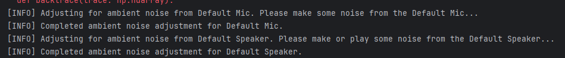
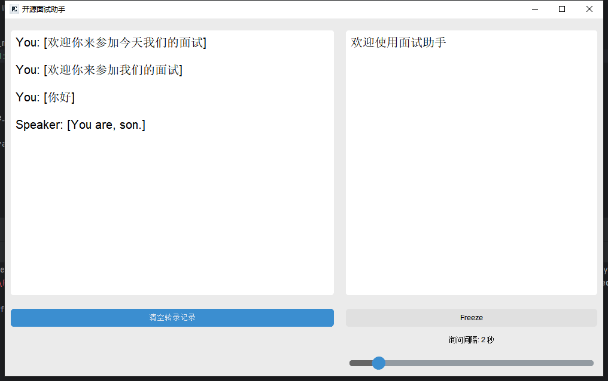
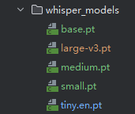

# 开源面试助手-Interview-Helper

## 环境

- Python >=3.8.0
- Windows 操作系统（未在其他系统上进行测试）
- FFmpeg(如果未安装，安装教程：https://blog.csdn.net/m0_47449768/article/details/130102406)

## 安装
1. 安装所需的软件包：

   ```
   pip install -r requirements.txt
   ```

2. 要用大模型回答，需要支持OpenAI格式的线上大模型。你可以在目录中创建一个 `keys.py` 文件并添加您的 OpenAI API Key：

   - 选项 1：执行时以变量传入。运行以下命令，将 "API KEY" 替换为实际的 OpenAI API Key：

      ```
      python -c "with open('keys.py', 'w', encoding='utf-8') as f: f.write('OPENAI_API_KEY=\"API KEY\"')"
      ```

   - 选项 2：在根目录下创建 keys.py，内容如下，将 "API KEY" 替换为 OpenAI API Key。

      ```
      OPENAI_API_KEY="API KEY"
      ```

## 运行

运行（使用本地的whisper模型）：

```
python main.py
```

也可以加上 --api ，将使用 whisper API 进行转录。

```
python main.py --api
```

### 扬声器测试
启动时会测试麦克风和扬声器是否配置正确。请说话和播放声音，以通过测试。



启动后,将开始实时转录您的麦克风输入和扬声器输出，并根据对话询问大模型。



## 配置本地转录模型 

该项目使用pt格式的Whipser模型，可以参照下面的"下载其它转录模型的方法",从Whisper.cpp项目下载，放到whisper_models文件夹中。



然后在TranscriberModels.py的`self.audio_model = whisper.load_model(os.path.join(os.getcwd(), <你下载的本地转录模型>))`中使用。

### 下载其它转录模型的方法

打开OpenAI的Whipser github: https://github.com/openai/whisper/blob/main/whisper/__init__.py#L17-L30

_MODELS 变量中是各模型的下载链接，在浏览器中打开，会自动开始下载。

2024/06/20的Models下载链接快照：
```
_MODELS = {
    "tiny.en": "https://openaipublic.azureedge.net/main/whisper/models/d3dd57d32accea0b295c96e26691aa14d8822fac7d9d27d5dc00b4ca2826dd03/tiny.en.pt",
    "tiny": "https://openaipublic.azureedge.net/main/whisper/models/65147644a518d12f04e32d6f3b26facc3f8dd46e5390956a9424a650c0ce22b9/tiny.pt",
    "base.en": "https://openaipublic.azureedge.net/main/whisper/models/25a8566e1d0c1e2231d1c762132cd20e0f96a85d16145c3a00adf5d1ac670ead/base.en.pt",
    "base": "https://openaipublic.azureedge.net/main/whisper/models/ed3a0b6b1c0edf879ad9b11b1af5a0e6ab5db9205f891f668f8b0e6c6326e34e/base.pt",
    "small.en": "https://openaipublic.azureedge.net/main/whisper/models/f953ad0fd29cacd07d5a9eda5624af0f6bcf2258be67c92b79389873d91e0872/small.en.pt",
    "small": "https://openaipublic.azureedge.net/main/whisper/models/9ecf779972d90ba49c06d968637d720dd632c55bbf19d441fb42bf17a411e794/small.pt",
    "medium.en": "https://openaipublic.azureedge.net/main/whisper/models/d7440d1dc186f76616474e0ff0b3b6b879abc9d1a4926b7adfa41db2d497ab4f/medium.en.pt",
    "medium": "https://openaipublic.azureedge.net/main/whisper/models/345ae4da62f9b3d59415adc60127b97c714f32e89e936602e85993674d08dcb1/medium.pt",
    "large-v1": "https://openaipublic.azureedge.net/main/whisper/models/e4b87e7e0bf463eb8e6956e646f1e277e901512310def2c24bf0e11bd3c28e9a/large-v1.pt",
    "large-v2": "https://openaipublic.azureedge.net/main/whisper/models/81f7c96c852ee8fc832187b0132e569d6c3065a3252ed18e56effd0b6a73e524/large-v2.pt",
    "large-v3": "https://openaipublic.azureedge.net/main/whisper/models/e5b1a55b89c1367dacf97e3e19bfd829a01529dbfdeefa8caeb59b3f1b81dadb/large-v3.pt",
    "large": "https://openaipublic.azureedge.net/main/whisper/models/e5b1a55b89c1367dacf97e3e19bfd829a01529dbfdeefa8caeb59b3f1b81dadb/large-v3.pt",
}
```

#### 可用模型

| 模型         | 磁盘    | SHA                                        |
| ------------- | ------- | ------------------------------------------ |
| tiny          | 75 MiB  | `bd577a113a864445d4c299885e0cb97d4ba92b5f` |
| tiny.en       | 75 MiB  | `c78c86eb1a8faa21b369bcd33207cc90d64ae9df` |
| base          | 142 MiB | `465707469ff3a37a2b9b8d8f89f2f99de7299dac` |
| base.en       | 142 MiB | `137c40403d78fd54d454da0f9bd998f78703390c` |
| small         | 466 MiB | `55356645c2b361a969dfd0ef2c5a50d530afd8d5` |
| small.en      | 466 MiB | `db8a495a91d927739e50b3fc1cc4c6b8f6c2d022` |
| small.en-tdrz | 465 MiB | `b6c6e7e89af1a35c08e6de56b66ca6a02a2fdfa1` |
| medium        | 1.5 GiB | `fd9727b6e1217c2f614f9b698455c4ffd82463b4` |
| medium.en     | 1.5 GiB | `8c30f0e44ce9560643ebd10bbe50cd20eafd3723` |
| large-v1      | 2.9 GiB | `b1caaf735c4cc1429223d5a74f0f4d0b9b59a299` |
| large-v2      | 2.9 GiB | `0f4c8e34f21cf1a914c59d8b3ce882345ad349d6` |
| large-v2-q5_0 | 1.1 GiB | `00e39f2196344e901b3a2bd5814807a769bd1630` |
| large-v3      | 2.9 GiB | `ad82bf6a9043ceed055076d0fd39f5f186ff8062` |
| large-v3-q5_0 | 1.1 GiB | `e6e2ed78495d403bef4b7cff42ef4aaadcfea8de` |

除非模型名称包含`.en`，那么模型是英语特化；否则模型是多语言的。以`-q5_0`结尾的模型是经过[量化处理](../README.md#quantization)的。以`-tdrz`结尾的模型支持使用[tinydiarize](https://github.com/akashmjn/tinydiarize)进行本地话者角色标记。关于模型的更多信息，请参阅[上游（openai/whisper）](https://github.com/openai/whisper#available-models-and-languages)。上述列表是由[download-ggml-model.sh](download-ggml-model.sh)脚本支持的模型的一个子集，但在https://huggingface.co/ggerganov/whisper.cpp/tree/main和其他地方还提供了更多模型。

### 模型选择

项目的默认模型是tiny.pt. 在3080平台上，中文任务、综合实时性和准确性，small表现较好。

## 开发计划

目前：完成本地转录+OpenAI回答。

---

v2: 支持官方Whipser转录，并直接回答。（2024/06:现在应该用4o了）
v3：支持本地Ollama大模型和线上的大模型。

## 加入开发、学习架构

我对所有文件和方法都尽可能地加上注释，让它成为程序员学习大模型应用的第一个项目。

如果你对面试助手开源感兴趣，或者单纯想要学习，都可以发邮件给我，加入开发群：jarvanzhao@qq.com

